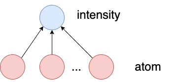

## Issues from Midterm Report

- Formulating the representation and model training (e.g., loss, other aspects) using basic mathematical notation (as is done in typical ML research) will considerably improve the clarity of the exposition. Currently, as a reader, I have only vague understanding of what is being done+planned -- it's hard to assess or give feedback on the ideas being explored.

- Based on the text description, **it's unclear if there is any probabilistic/generative modeling being done**, e.g., will the embedding, or decoding have any probabilsitic/generative components?

## MIST model

- Generating molecular structural fingerprint from spectra.

- Fingerprints:
  - 5496-dimensional fingerprint used by CSI:FingerID.
  - CSI:FingerID hashes a molecule graph (or smiles string) to a fingerprint.
  - These are sparse hashed fingerprints.
  - This means $(\text{spectra}, \text{fingerprint(molecule)}) \in \mathcal{D}$.
  - $\text{fingerprint(molecule)})$ is not typically injective... have to double check for CSI:FingerID

### Formula Embedder

- Each instance $n \in N_p$ is a peak of the spectra.

$$
\begin{aligned}
&h_i^{\prime(0)}=\text { FormulaEmbedder }\left(c_i\right)\\
&h_i^{\prime(0)}=\operatorname{Dropout}\left(\operatorname{ReLU}\left(W_f^2 \operatorname{Dropout}\left(\operatorname{ReLU}\left(W_f^1 c_i\right)\right)\right)\right)
\end{aligned}
$$

### Set Transformer

- Updates hidden representation of peaks $N_p$.

$$
h_i^{(l+1)}=\text { MutliheadAttention }\left(h_i^{(l)},\left\{h_j^{(l)}\right\}\right)
$$

- **Idea**: Each peak can or ordered according to its retention order. I am not sure if this is readily available in our preprocessed dataset.

### Pairwise Attention

Formula differences:

$$
d_{i, j}= \begin{cases}c_i-c_j & c_j \in c_i \\ c_j-c_i & c_i \in c_j \\ 0 & \end{cases}
$$

$$
f_{i, j}=\text { FormulaEmbedder }\left(d_{i, j}\right)
$$

#### Original Transformer

$$
K_j=W_k h_j^{(l)}, \quad Q_i=W_q h_i^{(l)}, \quad V_i=W_v h_i^{(l)}
$$

$$
A_{i, j} \propto Q_i K_j
$$

$$
h_i^{(l+1)}=\operatorname{Softmax}\left(A_i\right) V
$$

#### Mist Pairwise Attention

$$
A_{i, j} \propto\left(Q_i+b_1\right) K_j+\left(Q_i+b_2\right) f_{i, j}
$$

Where $b_1$ and $b_2$ are trainable biases.

### Pooling

- $h^{\text {out }}=h_0^{(L)}$ where $0^{th}$ hidden state instead of mean pooling
  - Found empirically.

### Loss Function

$$
\mathcal{L}_{\text {MIST }}=\mathcal{L}_{\text {targ }}+\lambda_{\text {unfold }} \mathcal{L}_{\text {unfold }}+\lambda_{\text {magma }} \mathcal{L}_{\text {magma }}
$$

- $\mathcal{L}_{\text {targ }}$ - Target Fingerprint prediction
- $\mathcal{L}_{\text {unfold }}$ - Unfolding Fingerprint prediction.
- $\mathcal{L}_{\text {magma }}$ - Substructure prediction.
  - This is an auxillary secondary task.

## Unfolding

- Like **progressive growing** in high resolution image generation.
  - The idea is to first learn coarse grained molecular properties before generating the full resolution property vector.

## Ideas

- Ridhas's Idea.

- My GNN Idea.

  - The intensity is really a global property of this aggregation.
  - The MLP is not position invariant.

- Idea. Enforce the pairwise difference formula in the loss. This would be a loss applied to the MS1 output from the transformer layer.

## Notes from Meeting

### Takeaways from Conversation

- Addressing the major issues "**it's unclear if there is any probabilistic/generative modeling being done**."
  - Since we have  $(\text{spectra}, \text{fingerprint(molecule)}) \in \mathcal{D}$, and we are trying to predict $\text{fingerprint}$, this a strucutred regression problem. If there is a one-to-one mapping between spectra and molecules we really don't need to be doing any sort of probabilistic modeling. This is not the case in general. There are some cases where very similar spectra are mapped to different molecules. In other words it would be beneficial to have a probabilistic output of generated candidates. We need to make this clear in the final draft.
    - We need to double check this within the dataset to see if there are any similar spectra have different fingerprints. In our case we can check from the peak formula matrix, look for duplicates and then see if the the corresponding CSI:fingerID is identical. This gives nice justification for this direction, is relatively easy.
- We should provided the basic outline of paper we are referencing I have done above. We can condense this into the **Algorithm**-like style to keep it relatively short.
- We only need to focus on modifying a few of the modules from the pipeline. I suggest 2 of us can work on modifying the MLP module and 2 of us can work on the attention module (we don't have to do the attention module, but since this was discussed in class it will be a good idea). This way if we have at least one change for each we can see if they provide any improvement when combined. If these are configured properly, they should be easy to mix and match. We can I think this is all we need to do to get good marks.
- Future work discussion (none of this has to be done for the final project, but it should give a half page or more discussion). Since the data in the mass spectrometry field is largely unlabelled this motivates using some sort of self-supervised training on spectra alone. Then using this generative model for the structured regression task, where we have the correct labels for spectra. Some basic assessment of the available data unlabelled data will help with this explanation.
  - We can also consider doing self-supervision on molecules, or incorporating a pretrained model for this. I am not sure how this can be tied in.

### Outline for Final Report

- 3.1 - Introduction and Motivation
- 3.2 - Literature Review
- 3.3 - Main paper we are referencing **Algorithm**-like recapitulation of their algorithm
- 3.4 - Project scope and aims.
  - 3.4.1. Modifying MLP module
  - 3.4.2. Modifying the Attention module.
  - 3.4.3 - Description of Data. We can describe **canpous_train** in greater detail, and we can move the other parts for the private labelled data to the discussion. I just got quotes for these data, and the lab will probably obtain them in the next month or two.
- 3.5 Results - Comparison in cosine similarities, and log-likelihoods.
  - 3.5.1 - MLP (modification 1) and MLP (modification 2)
  - 3.5.2 - Attention (modification 1) and Attention (modification 2)
  - 3.5.3 - Combinations of all modifications.
- 3.6 Discussion of results.
- 3.7 Future work.
